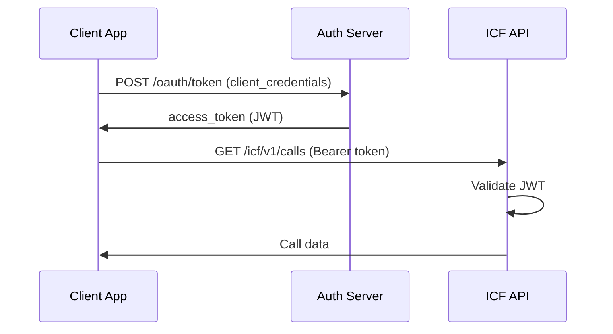

# AI Call Intelligence Suite - Implementation Plan

**Application Type**: ICF Experience Layer Demonstration
**Primary Goal**: Showcase AI-powered call analytics and real-time intelligence using Alianza ICF
**Target Users**: Contact centers, customer service teams, sales organizations
**Date**: January 6, 2026

---

## Executive Summary

The **AI Call Intelligence Suite** is a demonstration application that showcases the Alianza Intelligent Communications Fabric's (ICF) ability to deliver AI-infused communication services. It bridges existing Alianza v2 APIs with new ICF-style APIs to provide real-time call intelligence, post-call analytics, and actionable insights.

**Key Value Propositions:**
- 🎯 **Real-time Call Intelligence** - Live transcription, sentiment, and agent coaching
- 📊 **Post-Call Analytics** - Conversation insights, trends, and performance metrics
- 🤖 **AI-Powered Automation** - Smart routing, next-best-action recommendations
- 🔗 **CRM Integration** - Automatic call summarization and logging
- 💰 **Revenue Impact** - Upsell detection, customer satisfaction improvement

---

## Application Architecture

### High-Level Architecture

```
┌─────────────────────────────────────────────────────────────────┐
│                     AI Call Intelligence Suite                   │
│                      (Web Application + APIs)                    │
└─────────────────────────────────────────────────────────────────┘
                                 │
                    ┌────────────┴────────────┐
                    │                         │
         ┌──────────▼──────────┐   ┌─────────▼──────────┐
         │   ICF Experience    │   │  ICF Orchestration │
         │       Layer         │   │       Layer        │
         │   (New APIs)        │   │   (New APIs)       │
         └─────────────────────┘   └─────────────────────┘
                    │                         │
         ┌──────────┴─────────────────────────▼──────────┐
         │         Alianza ICF Infrastructure            │
         │    (SIP/RTP → Modern APIs & Media Formats)    │
         └──────────────────────────────────────────────┘
                                 │
                    ┌────────────┴────────────┐
                    │                         │
         ┌──────────▼──────────┐   ┌─────────▼──────────┐
         │  Existing v2 APIs   │   │   AI Services      │
         │  - CDR Search       │   │  - Transcription   │
         │  - Account Mgmt     │   │  - Sentiment       │
         │  - User Mgmt        │   │  - NLU/Intent      │
         └─────────────────────┘   └────────────────────┘
```

### Three-Layer ICF Implementation

#### 1. Infrastructure Layer (Use Existing)
- Alianza's existing v2 platform
- SIP/RTP media handling
- CDR generation and storage
- Account/user/device management

#### 2. Orchestration Layer (Build New ICF APIs)
- **Call Event Stream API** - Real-time call events via WebSocket/SSE
- **Media Processing API** - Audio extraction and streaming
- **Workflow Automation API** - Trigger actions based on call intelligence
- **Integration Hub API** - Connect to CRMs, helpdesks, business tools

#### 3. Experience Layer (Build Application)
- **Real-Time Dashboard** - Live call monitoring with AI insights
- **Analytics Dashboard** - Historical trends and performance metrics
- **Agent Workspace** - Real-time assistance for contact center agents
- **Admin Console** - Configuration and management

---

## New ICF API Specifications

### API Design Principles

Following ICF's vision of abstracting complexity:

```
✅ Good ICF API:  POST /icf/v1/calls/{callId}/transcribe
❌ Bad v2-style:  POST /v2/partition/{id}/account/{id}/device/{id}/media/process
```

**Core Principles:**
1. **Resource-oriented** - Focus on business concepts (calls, insights, agents)
2. **Event-driven** - Real-time updates via webhooks/WebSockets
3. **Intelligent defaults** - Minimal configuration required
4. **GraphQL-friendly** - Flexible querying of related data
5. **OAuth 2.0** - Modern authentication and scoping

---

## ICF API 1: Call Events API

### Purpose
Real-time stream of call lifecycle events with AI enrichment

### REST Endpoints

#### Subscribe to Call Events
```http
POST /icf/v1/call-events/subscriptions
Content-Type: application/json
Authorization: Bearer {oauth_token}

{
  "accountId": "acct_12345",
  "events": [
    "call.started",
    "call.answered",
    "call.ended",
    "call.transcription.partial",
    "call.transcription.final",
    "call.sentiment.updated",
    "call.intent.detected"
  ],
  "webhookUrl": "https://your-app.com/webhooks/call-events",
  "filters": {
    "callType": ["INBOUND"],
    "userIds": ["user_123", "user_456"]
  }
}
```

**Response:**
```json
{
  "subscriptionId": "sub_abc123",
  "status": "active",
  "createdAt": "2026-01-06T10:00:00Z",
  "expiresAt": "2026-01-06T18:00:00Z"
}
```

#### WebSocket Stream (Alternative)
```javascript
const ws = new WebSocket('wss://icf-api.alianza.com/v1/call-events/stream');

ws.onopen = () => {
  ws.send(JSON.stringify({
    type: 'subscribe',
    accountId: 'acct_12345',
    events: ['call.started', 'call.transcription.partial'],
    token: 'Bearer ...'
  }));
};

ws.onmessage = (event) => {
  const data = JSON.parse(event.data);
  // Handle real-time call event
};
```

### Event Payload Examples

#### call.started
```json
{
  "eventId": "evt_xyz789",
  "eventType": "call.started",
  "timestamp": "2026-01-06T10:15:30.123Z",
  "call": {
    "callId": "call_abc123",
    "sessionId": "ses_456def",
    "direction": "INBOUND",
    "from": "+15551234567",
    "to": "+15559876543",
    "accountId": "acct_12345",
    "userId": "user_123",
    "deviceId": "dev_789",
    "metadata": {
      "callerLocation": {
        "city": "San Francisco",
        "state": "CA",
        "country": "US"
      },
      "stirShaken": {
        "attestLevel": "A",
        "verstat": "TN_VALIDATION_PASSED"
      }
    }
  }
}
```

#### call.transcription.partial
```json
{
  "eventId": "evt_partial_001",
  "eventType": "call.transcription.partial",
  "timestamp": "2026-01-06T10:15:35.456Z",
  "call": {
    "callId": "call_abc123"
  },
  "transcription": {
    "segmentId": "seg_001",
    "speaker": "caller",
    "text": "Hi, I'm having trouble with my internet connection",
    "confidence": 0.94,
    "language": "en-US",
    "startTime": 2.5,
    "endTime": 5.8
  }
}
```

#### call.sentiment.updated
```json
{
  "eventId": "evt_sent_001",
  "eventType": "call.sentiment.updated",
  "timestamp": "2026-01-06T10:15:36.789Z",
  "call": {
    "callId": "call_abc123"
  },
  "sentiment": {
    "overall": "negative",
    "score": -0.6,
    "confidence": 0.88,
    "emotions": {
      "frustrated": 0.7,
      "confused": 0.3
    },
    "trend": "declining"
  },
  "insights": {
    "alert": true,
    "reason": "Customer frustration detected",
    "recommendation": "Escalate to senior agent or offer callback"
  }
}
```

#### call.intent.detected
```json
{
  "eventId": "evt_intent_001",
  "eventType": "call.intent.detected",
  "timestamp": "2026-01-06T10:15:37.012Z",
  "call": {
    "callId": "call_abc123"
  },
  "intent": {
    "name": "technical_support",
    "subIntent": "internet_connectivity_issue",
    "confidence": 0.91,
    "entities": {
      "service": "internet",
      "issue_type": "connection_down"
    }
  },
  "suggestedActions": [
    {
      "action": "transfer",
      "target": "technical_support_queue",
      "priority": "high"
    },
    {
      "action": "display_knowledge_article",
      "articleId": "kb_internet_troubleshooting_101"
    }
  ]
}
```

---

## ICF API 2: Call Intelligence API

### Purpose
Query and manage AI-generated insights for calls

### REST Endpoints

#### Get Call Intelligence
```http
GET /icf/v1/calls/{callId}/intelligence
Authorization: Bearer {oauth_token}

Response 200 OK:
{
  "callId": "call_abc123",
  "intelligence": {
    "summary": {
      "title": "Internet Connectivity Issue - Resolved",
      "description": "Customer called about internet outage. Agent diagnosed modem issue and scheduled technician visit for tomorrow 2-4pm.",
      "outcome": "resolved",
      "nextSteps": ["Technician visit scheduled", "Follow-up call in 48 hours"]
    },
    "transcription": {
      "fullText": "Full conversation transcript...",
      "segments": [...],
      "duration": 324,
      "wordCount": 412,
      "languages": ["en-US"]
    },
    "sentiment": {
      "overall": "positive",
      "journey": [
        {"time": 0, "score": -0.6, "label": "frustrated"},
        {"time": 120, "score": 0.2, "label": "neutral"},
        {"time": 300, "score": 0.8, "label": "satisfied"}
      ],
      "avgCustomerSentiment": 0.65,
      "avgAgentSentiment": 0.75
    },
    "topics": [
      {"name": "internet_connectivity", "confidence": 0.95, "mentions": 8},
      {"name": "modem_troubleshooting", "confidence": 0.89, "mentions": 5},
      {"name": "technician_scheduling", "confidence": 0.92, "mentions": 3}
    ],
    "keywords": [
      "internet down", "modem lights", "power cycle",
      "technician", "appointment", "tomorrow"
    ],
    "actionItems": [
      {
        "action": "Schedule technician visit",
        "status": "completed",
        "dueDate": "2026-01-07",
        "assignedTo": "field_services"
      },
      {
        "action": "Follow-up call",
        "status": "pending",
        "dueDate": "2026-01-08",
        "assignedTo": "user_123"
      }
    ],
    "qualityMetrics": {
      "agentPerformance": {
        "empathy": 0.85,
        "professionalism": 0.92,
        "knowledgeability": 0.88,
        "resolutionEffectiveness": 0.90
      },
      "callQuality": {
        "audioQuality": 4.5,
        "clarity": 4.7,
        "background_noise": "minimal"
      },
      "complianceChecks": {
        "greetingPresent": true,
        "dataSecurityMentioned": true,
        "callbackOffered": true,
        "surveyOffered": false
      }
    },
    "businessInsights": {
      "upsellOpportunity": false,
      "churnRisk": "low",
      "customerSatisfaction": 8.5,
      "estimatedValue": {
        "currency": "USD",
        "retainedRevenue": 89.99
      }
    }
  },
  "metadata": {
    "processingTime": 3.2,
    "aiModelsUsed": [
      "whisper-v3-turbo",
      "sentiment-analyzer-v2",
      "intent-classifier-v4"
    ],
    "generatedAt": "2026-01-06T10:20:45Z"
  }
}
```

#### Search Intelligent Insights
```http
POST /icf/v1/intelligence/search
Content-Type: application/json
Authorization: Bearer {oauth_token}

{
  "accountId": "acct_12345",
  "dateRange": {
    "start": "2026-01-01",
    "end": "2026-01-06"
  },
  "filters": {
    "sentiment": ["negative", "very_negative"],
    "topics": ["billing_dispute", "cancellation_request"],
    "churnRisk": ["medium", "high"],
    "duration": {"min": 300}
  },
  "sort": {
    "field": "sentiment.overall",
    "order": "asc"
  },
  "limit": 50
}

Response 200 OK:
{
  "totalResults": 127,
  "results": [
    {
      "callId": "call_xyz789",
      "timestamp": "2026-01-05T14:30:00Z",
      "summary": "Customer threatening to cancel service due to billing issues",
      "sentiment": {"overall": "very_negative", "score": -0.85},
      "churnRisk": "high",
      "priority": "critical"
    },
    ...
  ],
  "aggregations": {
    "avgSentiment": -0.45,
    "topTopics": ["billing_dispute", "price_increase", "cancellation"],
    "highChurnRiskCount": 23
  }
}
```

---

## ICF API 3: Real-Time Agent Assist API

### Purpose
Provide real-time assistance to agents during live calls

### REST Endpoints

#### Get Real-Time Suggestions
```http
GET /icf/v1/calls/{callId}/agent-assist/suggestions
Authorization: Bearer {oauth_token}

Response 200 OK:
{
  "callId": "call_abc123",
  "currentContext": {
    "intent": "technical_support",
    "sentiment": "frustrated",
    "topic": "internet_connectivity"
  },
  "suggestions": [
    {
      "type": "knowledge_article",
      "title": "Internet Troubleshooting Guide",
      "snippet": "Step 1: Check modem lights. Solid green = good...",
      "articleId": "kb_001",
      "relevance": 0.95
    },
    {
      "type": "script",
      "title": "Empathy Statement for Technical Issues",
      "text": "I understand how frustrating it is when your internet isn't working. Let me help you get this resolved right away.",
      "relevance": 0.88
    },
    {
      "type": "similar_call",
      "title": "Similar call resolved yesterday",
      "resolution": "Modem firmware update resolved issue",
      "callId": "call_prev_456",
      "relevance": 0.82
    }
  ],
  "alerts": [
    {
      "level": "warning",
      "message": "Customer sentiment declining - consider empathy statement",
      "action": "Use suggested script"
    }
  ],
  "nextBestActions": [
    {
      "action": "Run remote diagnostic",
      "confidence": 0.89,
      "expectedResolution": "70%"
    },
    {
      "action": "Schedule technician",
      "confidence": 0.65,
      "expectedResolution": "95%"
    }
  ]
}
```

#### Send Agent Action
```http
POST /icf/v1/calls/{callId}/agent-assist/actions
Content-Type: application/json
Authorization: Bearer {oauth_token}

{
  "action": "used_suggestion",
  "suggestionId": "sug_123",
  "feedback": {
    "helpful": true,
    "rating": 5
  }
}
```

---

## ICF API 4: Analytics & Reporting API

### Purpose
Aggregate intelligence across calls for trends and insights

### REST Endpoints

#### Get Analytics Dashboard
```http
GET /icf/v1/analytics/dashboard?accountId=acct_12345&period=7d
Authorization: Bearer {oauth_token}

Response 200 OK:
{
  "period": {
    "start": "2025-12-30",
    "end": "2026-01-06"
  },
  "metrics": {
    "totalCalls": 1247,
    "totalDuration": 423890,
    "avgDuration": 340,
    "avgSentiment": 0.62,
    "resolutionRate": 0.87,
    "escalationRate": 0.13,
    "avgCustomerSatisfaction": 7.8
  },
  "trends": {
    "callVolume": {
      "trend": "increasing",
      "percentChange": 12.5,
      "peakHours": [10, 11, 14, 15]
    },
    "sentiment": {
      "trend": "improving",
      "percentChange": 5.3
    },
    "topIssues": [
      {"topic": "billing_questions", "count": 234, "avgResolutionTime": 280},
      {"topic": "technical_support", "count": 189, "avgResolutionTime": 420},
      {"topic": "account_changes", "count": 156, "avgResolutionTime": 190}
    ]
  },
  "agentPerformance": [
    {
      "userId": "user_123",
      "name": "Jane Smith",
      "callsHandled": 87,
      "avgSentiment": 0.78,
      "resolutionRate": 0.92,
      "avgHandleTime": 310,
      "qualityScore": 8.9
    },
    ...
  ],
  "insights": {
    "opportunities": [
      {
        "type": "training_need",
        "description": "Agents struggling with new billing system questions",
        "impact": "medium",
        "recommendation": "Schedule product training session"
      },
      {
        "type": "upsell",
        "description": "15 customers asked about premium features",
        "impact": "high",
        "estimatedRevenue": 14250,
        "recommendation": "Create targeted upsell campaign"
      }
    ],
    "risks": [
      {
        "type": "churn",
        "description": "23 high-risk customers identified this week",
        "impact": "high",
        "estimatedLoss": 27500,
        "recommendation": "Proactive retention outreach"
      }
    ]
  }
}
```

---

## ICF API 5: CRM Integration API

### Purpose
Automatically sync call intelligence with business systems

### REST Endpoints

#### Configure CRM Integration
```http
POST /icf/v1/integrations/crm
Content-Type: application/json
Authorization: Bearer {oauth_token}

{
  "crmType": "salesforce",
  "credentials": {
    "instanceUrl": "https://yourcompany.salesforce.com",
    "accessToken": "...",
    "refreshToken": "..."
  },
  "mappings": {
    "callToActivity": {
      "subject": "{{call.summary.title}}",
      "description": "{{call.summary.description}}",
      "status": "{{call.summary.outcome}}",
      "duration": "{{call.duration}}"
    },
    "customFields": {
      "Sentiment__c": "{{call.sentiment.overall}}",
      "AI_Summary__c": "{{call.summary.description}}",
      "Next_Steps__c": "{{call.summary.nextSteps}}"
    }
  },
  "triggers": {
    "syncOnCallEnd": true,
    "syncOnHighChurnRisk": true,
    "syncOnUpsellOpportunity": true
  }
}

Response 201 Created:
{
  "integrationId": "int_crm_001",
  "status": "active",
  "lastSync": null,
  "createdAt": "2026-01-06T10:00:00Z"
}
```

#### Manual Sync to CRM
```http
POST /icf/v1/calls/{callId}/sync-to-crm
Content-Type: application/json
Authorization: Bearer {oauth_token}

{
  "integrationId": "int_crm_001",
  "contactId": "003XXXXXXXXXXXXXXX"
}
```

---

## Technology Stack

### Backend Services

#### API Layer
- **Framework**: Node.js with Express.js or Fastify
  - Fast, event-driven architecture
  - Excellent WebSocket support
  - Large ecosystem

- **Alternative**: Python with FastAPI
  - Better AI/ML library support
  - Async/await built-in
  - Auto-generated OpenAPI docs

**Recommendation**: **Node.js** for real-time requirements, **Python microservices** for AI processing

#### Database
- **Primary Database**: PostgreSQL
  - JSONB for flexible call intelligence storage
  - Full-text search for transcriptions
  - Time-series optimization for analytics

- **Cache Layer**: Redis
  - Real-time call state
  - Session management
  - Rate limiting

- **Time-Series DB**: TimescaleDB (PostgreSQL extension)
  - Call metrics and analytics
  - Sentiment tracking over time

#### Message Queue
- **Apache Kafka** or **RabbitMQ**
  - Event streaming from Alianza platform
  - Asynchronous AI processing
  - Webhook delivery

#### Real-Time Communication
- **WebSocket Server**: Socket.io or native WebSocket
- **Alternative**: Server-Sent Events (SSE) for simpler one-way streaming

---

### AI/ML Services

#### Speech-to-Text (Transcription)
**Options:**
1. **OpenAI Whisper** (Self-hosted or API)
   - High accuracy
   - Multilingual support
   - Open source option available

2. **Google Speech-to-Text**
   - Real-time streaming
   - Speaker diarization
   - Custom vocabulary

3. **AWS Transcribe**
   - Call analytics features built-in
   - PII redaction
   - Custom language models

**Recommendation**: **OpenAI Whisper API** for simplicity + **Google Speech-to-Text** for real-time

#### Sentiment Analysis
**Options:**
1. **OpenAI GPT-4** (via API)
   - Nuanced understanding
   - Emotion detection
   - Explanation of sentiment

2. **Hugging Face Transformers** (Self-hosted)
   - DistilBERT, RoBERTa models
   - Fine-tunable
   - Cost-effective

3. **AWS Comprehend**
   - Managed service
   - Entity recognition included

**Recommendation**: **Hugging Face** for cost + **GPT-4** for complex analysis

#### Intent Classification / NLU
**Options:**
1. **Rasa** (Self-hosted)
   - Open source
   - Custom intent training
   - Entity extraction

2. **Dialogflow CX**
   - Google's enterprise NLU
   - Pre-built agents
   - Flow management

3. **Custom ML Model**
   - TensorFlow/PyTorch
   - Full control
   - Training overhead

**Recommendation**: **Rasa** for customization + **GPT-4** for zero-shot intent detection

#### Summarization
**Options:**
1. **OpenAI GPT-4**
   - High-quality summaries
   - Customizable prompts
   - Action item extraction

2. **Anthropic Claude**
   - Long context window (200k tokens)
   - Excellent at following instructions
   - Good for complex calls

**Recommendation**: **GPT-4** for summaries, **Claude** for very long calls

---

### Frontend Application

#### Framework
- **React** with **TypeScript**
  - Component reusability
  - Strong typing
  - Large ecosystem

#### UI Component Library
- **Tailwind CSS** + **shadcn/ui**
  - Modern, customizable
  - Accessible components
  - Dark mode support

#### Real-Time Updates
- **React Query** for data fetching
- **Socket.io-client** for WebSocket
- **Zustand** or **Redux** for state management

#### Visualization
- **Recharts** or **Chart.js** for analytics
- **D3.js** for custom sentiment journey charts
- **Lucide React** for icons

#### Audio/Video
- **WebRTC** for live call monitoring
- **Wavesurfer.js** for audio waveform visualization

---

### Infrastructure & DevOps

#### Hosting
- **Cloud Provider**: AWS or Google Cloud
  - Compute: ECS/Fargate or Cloud Run
  - Storage: S3 or Cloud Storage
  - CDN: CloudFront or Cloud CDN

#### CI/CD
- **GitHub Actions**
  - Automated testing
  - Docker image builds
  - Deployment pipelines

#### Monitoring
- **Application**: Sentry for error tracking
- **Infrastructure**: Datadog or Grafana
- **Logs**: ELK Stack or CloudWatch

#### Security
- **OAuth 2.0**: Auth0 or Keycloak
- **API Gateway**: Kong or AWS API Gateway
- **Secrets**: AWS Secrets Manager or Vault

---

## MVP Feature Roadmap

### Phase 1: Foundation (Weeks 1-2)

**Goal**: Core infrastructure and basic call intelligence

**Features:**
- ✅ Authentication & authorization (OAuth 2.0)
- ✅ Connection to Alianza v2 CDR API
- ✅ Basic call list view with filters
- ✅ Post-call transcription (batch processing)
- ✅ Basic sentiment analysis
- ✅ Call detail page with intelligence

**APIs Built:**
- `GET /icf/v1/calls` - List calls
- `GET /icf/v1/calls/{callId}` - Get call details
- `GET /icf/v1/calls/{callId}/intelligence` - Get AI insights
- `POST /icf/v1/calls/{callId}/transcribe` - Trigger transcription

**Demo Scenario:**
- User logs in
- Views recent calls
- Clicks on a call
- Sees transcript, sentiment, and summary

---

### Phase 2: Real-Time Intelligence (Weeks 3-4)

**Goal**: Live call monitoring and agent assistance

**Features:**
- ✅ WebSocket connection for real-time events
- ✅ Live call dashboard
- ✅ Real-time transcription streaming
- ✅ Sentiment tracking during calls
- ✅ Agent assist sidebar with suggestions
- ✅ Alerts for negative sentiment

**APIs Built:**
- `WS /icf/v1/call-events/stream` - WebSocket stream
- `POST /icf/v1/call-events/subscriptions` - Webhook subscriptions
- `GET /icf/v1/calls/{callId}/agent-assist/suggestions` - Real-time suggestions

**Demo Scenario:**
- Agent receives incoming call
- Dashboard shows live transcription
- Sentiment indicator updates in real-time
- System suggests knowledge articles
- Alert appears when customer gets frustrated
- Agent uses suggestion to resolve issue

---

### Phase 3: Analytics & Insights (Weeks 5-6)

**Goal**: Historical analysis and trend identification

**Features:**
- ✅ Analytics dashboard with key metrics
- ✅ Sentiment journey visualization
- ✅ Topic clustering and trending
- ✅ Agent performance leaderboard
- ✅ Custom report builder
- ✅ Exportable reports (CSV, PDF)

**APIs Built:**
- `GET /icf/v1/analytics/dashboard` - Dashboard metrics
- `POST /icf/v1/intelligence/search` - Advanced search
- `GET /icf/v1/analytics/trends` - Trend analysis
- `GET /icf/v1/analytics/agents/{userId}` - Agent performance

**Demo Scenario:**
- Manager opens analytics dashboard
- Views call volume trends over 30 days
- Identifies spike in billing-related calls
- Drills down into sentiment for billing calls
- Discovers training gap for new billing system
- Exports report for leadership meeting

---

### Phase 4: Automation & Integration (Weeks 7-8)

**Goal**: Business system integration and workflow automation

**Features:**
- ✅ CRM integration (Salesforce, HubSpot)
- ✅ Automatic call logging
- ✅ Smart routing based on intent
- ✅ Automated follow-up tasks
- ✅ Webhook-based workflow triggers
- ✅ Email digest of daily insights

**APIs Built:**
- `POST /icf/v1/integrations/crm` - Configure CRM integration
- `POST /icf/v1/calls/{callId}/sync-to-crm` - Manual sync
- `POST /icf/v1/workflows` - Create automation workflow
- `GET /icf/v1/workflows/{workflowId}/executions` - Workflow history

**Demo Scenario:**
- New call comes in
- AI detects billing dispute intent
- Call automatically routed to billing specialist
- During call, CRM contact record opens
- Call ends, summary auto-saved to CRM
- Task created for follow-up call
- Manager receives daily digest email

---

## Demo Scenarios

### Scenario 1: Technical Support Call

**Actors**: Customer (Sarah), Support Agent (Mike), System

**Flow:**
1. **Call Start** (00:00)
   - Sarah calls support line: "My internet isn't working"
   - System detects intent: `technical_support` / `internet_connectivity`
   - Routes to tech support queue
   - Mike answers, sees customer name and issue type pre-populated

2. **Real-Time Assistance** (00:30)
   - Live transcription shows Sarah describing blinking lights on modem
   - System suggests KB article: "Modem Light Codes"
   - Mike follows troubleshooting steps from suggested article
   - Sentiment: neutral → slightly frustrated

3. **Escalation Prevention** (03:00)
   - Sentiment drops to "frustrated" when basic steps don't work
   - Alert appears: "Customer frustration detected"
   - System suggests: "Offer callback or escalate to Level 2"
   - Mike proactively offers to schedule technician

4. **Resolution** (04:30)
   - Technician scheduled for tomorrow
   - Sentiment improves to "satisfied"
   - System detects action item: "Technician visit tomorrow 2-4pm"
   - Call ends

5. **Post-Call** (Automatic)
   - Transcript and summary generated within 10 seconds
   - CRM updated with call summary and appointment details
   - Task created for follow-up call after technician visit
   - Mike's performance score updated (positive resolution)

**Metrics:**
- Call duration: 5 minutes 12 seconds
- Sentiment journey: neutral → frustrated → satisfied
- Resolution: Yes (first call)
- Customer satisfaction: 8/10 (inferred)

---

### Scenario 2: Sales Upsell Opportunity

**Actors**: Customer (David), Sales Agent (Lisa), System

**Flow:**
1. **Call Start** (00:00)
   - David calls to ask about current plan pricing
   - Intent: `account_inquiry` / `billing_question`
   - System shows David's account value: $49/mo basic plan

2. **Opportunity Detection** (01:30)
   - David mentions: "I've been working from home more, need faster speeds"
   - System detects upsell opportunity for premium plan
   - Suggests: "Customer eligible for $99/mo premium plan"
   - Lisa sees recommendation with talking points

3. **Guided Upsell** (02:00)
   - Lisa presents premium plan benefits
   - System tracks David's responses
   - Positive signals: "That sounds good", "How much faster?"
   - Sentiment: interested, positive

4. **Objection Handling** (03:30)
   - David: "That's more than I wanted to spend"
   - System suggests discount offer: "First 3 months 20% off"
   - Lisa presents offer
   - David accepts

5. **Close** (05:00)
   - Upgrade scheduled to take effect tomorrow
   - System logs: upsell_successful, revenue_impact: +$600/year
   - Confirmation email triggered automatically

**Metrics:**
- Call duration: 5 minutes 45 seconds
- Sentiment: neutral → interested → hesitant → positive
- Outcome: Upsell successful
- Revenue impact: $600 annual increase

---

### Scenario 3: Churn Prevention

**Actors**: Customer (Maria), Retention Agent (Tom), System

**Flow:**
1. **Proactive Alert** (Morning)
   - System analyzes previous call from Maria (2 days ago)
   - Detected: high frustration, mentioned "looking at competitors"
   - Churn risk: HIGH (85% probability)
   - Alert sent to retention team

2. **Outbound Call** (10:00 AM)
   - Tom makes proactive retention call to Maria
   - System displays Maria's history:
     - Recent billing issue (resolved but took 3 calls)
     - Mentioned competitor XYZ offers lower price
     - Customer for 5 years, $89/mo value

3. **Personalized Approach** (01:00)
   - Tom acknowledges billing issue frustration
   - System suggests retention offer: loyalty discount
   - Tom presents: $15/mo discount for 12 months
   - Maria appreciates proactive outreach

4. **Save** (04:00)
   - Maria accepts retention offer
   - Sentiment: frustrated → appreciated → loyal
   - System updates: churn_risk: LOW
   - Retained revenue: $1,068/year

**Metrics:**
- Proactive intervention: Yes
- Time to action: 2 days from risk detection
- Outcome: Customer retained
- Retained revenue: $1,068

---

## Development Timeline

### 8-Week MVP Plan

**Week 1: Project Setup & Foundation**
- Set up repositories, CI/CD
- Configure development environments
- Set up databases (PostgreSQL, Redis)
- Implement authentication (OAuth 2.0)
- Create basic API structure

**Week 2: Alianza Integration & Basic UI**
- Integrate with Alianza v2 CDR API
- Build call list view
- Implement call detail page
- Set up basic transcription pipeline
- Create user authentication flow

**Week 3: AI Service Integration**
- Integrate speech-to-text (Whisper/Google)
- Implement sentiment analysis
- Build summarization pipeline
- Create call intelligence processing service
- Test accuracy and performance

**Week 4: Real-Time Infrastructure**
- Set up WebSocket server
- Implement event streaming
- Build real-time dashboard UI
- Create agent assist sidebar
- Test real-time performance

**Week 5: Analytics & Reporting**
- Build analytics dashboard
- Implement trend analysis
- Create visualization components
- Build report generation
- Optimize database queries

**Week 6: Integration Framework**
- Build CRM integration framework
- Implement Salesforce connector
- Create webhook system
- Build workflow automation engine
- Test integration flows

**Week 7: Polish & Testing**
- UI/UX refinements
- Performance optimization
- Security hardening
- Load testing
- Bug fixes

**Week 8: Demo Preparation & Documentation**
- Create demo scenarios with sample data
- Record demo videos
- Write documentation
- Prepare presentation materials
- Final testing

---

## Success Metrics

### Technical Metrics
- **Transcription Accuracy**: >95% word error rate
- **Real-Time Latency**: <2s for transcription segments
- **Sentiment Accuracy**: >85% agreement with human labelers
- **API Response Time**: <200ms (p95)
- **System Uptime**: >99.9%

### Business Metrics
- **Time to Insight**: <30s post-call summary generation
- **Agent Productivity**: 20% reduction in handle time
- **Customer Satisfaction**: 15% improvement (from insights)
- **Resolution Rate**: 10% improvement (first call resolution)
- **Revenue Impact**: $50k+ identified upsell opportunities

### Demo Success Criteria
- ✅ Live call demonstration with real-time transcription
- ✅ Sentiment changes reflected immediately
- ✅ Agent assists suggestions appear within 5 seconds
- ✅ Post-call summary generated in <30 seconds
- ✅ CRM integration shows data sync in real-time
- ✅ Analytics dashboard shows trends from sample dataset

---

## ICF Demonstration Value

### How This Showcases ICF

**Infrastructure Layer**:
- Uses existing Alianza v2 APIs (CDR, accounts, users)
- Demonstrates platform reliability and scale

**Orchestration Layer**:
- New ICF-style APIs abstract SIP/RTP complexity
- Event-driven architecture for real-time intelligence
- Workflow automation connects legacy systems to modern apps

**Experience Layer**:
- AI-infused services (transcription, sentiment, NLU)
- Modern web application interface
- Integration with business tools (CRM, helpdesk)

### Customer Value Propositions

**For Contact Centers**:
- Improve agent performance with real-time coaching
- Increase customer satisfaction through better service
- Reduce training time with intelligent suggestions

**For Sales Teams**:
- Never miss an upsell opportunity
- Data-driven sales coaching
- Automatic CRM updates save time

**For Operations**:
- Identify trends before they become problems
- Optimize staffing based on call patterns
- Make data-driven decisions

**For CSPs (Alianza Customers)**:
- New revenue stream: offer AI call intelligence to their customers
- Competitive differentiation in crowded market
- Leverage existing infrastructure investment

---

## Next Steps

### Immediate Actions
1. **Validate Technical Approach**
   - Review architecture with stakeholders
   - Confirm AI service choices
   - Verify Alianza API capabilities

2. **Finalize Scope**
   - Prioritize MVP features
   - Define demo scenarios
   - Set success criteria

3. **Resource Planning**
   - Assemble development team
   - Procure necessary tools/services
   - Set up development environment

4. **Kickoff Development**
   - Week 1: Foundation setup
   - Daily standups
   - Bi-weekly demos

### Future Enhancements (Post-MVP)

**Advanced AI Features**:
- Predictive call routing (route to best agent)
- Automatic call scoring
- Compliance monitoring (PCI-DSS, TCPA)
- Multi-language support

**Expanded Integrations**:
- Microsoft Teams, Zoom integration
- Helpdesk systems (Zendesk, Freshdesk)
- BI tools (Tableau, PowerBI)
- Slack/Teams notifications

**Enterprise Features**:
- Multi-tenant architecture
- Role-based access control
- Custom AI model training
- White-label capabilities

**Mobile App**:
- iOS/Android apps for managers
- Real-time alerts on mobile
- Voice commands for queries

---

## Appendix

### API Authentication Flow



### Event Flow Diagram

```
┌──────────────┐
│ Alianza      │
│ Platform     │
│ (SIP/RTP)    │
└──────┬───────┘
       │ Call Events
       ▼
┌──────────────────────┐
│ ICF Orchestration    │
│ - Event Capture      │
│ - Media Extraction   │
│ - Event Publishing   │
└──────┬───────────────┘
       │ Events (Kafka/RabbitMQ)
       ├────────────────┬────────────────┐
       ▼                ▼                ▼
┌──────────────┐ ┌─────────────┐ ┌──────────────┐
│ Transcription│ │  Sentiment  │ │     NLU      │
│   Service    │ │   Analysis  │ │   Service    │
└──────┬───────┘ └──────┬──────┘ └──────┬───────┘
       │                │                │
       └────────────────┴────────────────┘
                        │ Intelligence
                        ▼
                 ┌──────────────┐
                 │  PostgreSQL  │
                 │  + Redis     │
                 └──────┬───────┘
                        │
                        ▼
                 ┌──────────────┐
                 │  ICF APIs    │
                 └──────┬───────┘
                        │
           ┌────────────┴────────────┐
           ▼                         ▼
    ┌─────────────┐          ┌─────────────┐
    │   Web App   │          │  Webhooks   │
    │  (React)    │          │  (CRM sync) │
    └─────────────┘          └─────────────┘
```

### Sample Data Model

**calls table:**
```sql
CREATE TABLE calls (
  call_id UUID PRIMARY KEY,
  account_id VARCHAR NOT NULL,
  user_id VARCHAR,
  direction VARCHAR(10), -- INBOUND, OUTBOUND
  from_number VARCHAR(20),
  to_number VARCHAR(20),
  start_time TIMESTAMP,
  connect_time TIMESTAMP,
  end_time TIMESTAMP,
  duration_seconds INTEGER,
  status VARCHAR(20),
  metadata JSONB,
  created_at TIMESTAMP DEFAULT NOW()
);
```

**call_intelligence table:**
```sql
CREATE TABLE call_intelligence (
  id UUID PRIMARY KEY,
  call_id UUID REFERENCES calls(call_id),
  transcription TEXT,
  summary JSONB,
  sentiment JSONB,
  topics JSONB,
  keywords TEXT[],
  action_items JSONB,
  quality_metrics JSONB,
  business_insights JSONB,
  processing_time_ms INTEGER,
  created_at TIMESTAMP DEFAULT NOW()
);
```

**real_time_events table:**
```sql
CREATE TABLE real_time_events (
  id UUID PRIMARY KEY,
  call_id UUID REFERENCES calls(call_id),
  event_type VARCHAR(50),
  timestamp TIMESTAMP,
  data JSONB,
  created_at TIMESTAMP DEFAULT NOW()
);

CREATE INDEX idx_events_call_id ON real_time_events(call_id);
CREATE INDEX idx_events_timestamp ON real_time_events(timestamp);
```

---

## Document Metadata

**Version**: 1.0
**Last Updated**: January 6, 2026
**Status**: Draft - Ready for Review
**Related Documents**:
- ICF_RESEARCH.md
- CASE_STUDIES_REVIEW.md
- openapi.yaml (Alianza v2 API spec)

**Authors**: Claude Code
**Reviewers**: [TBD]
**Approvers**: [TBD]

---

**Ready to build? 🚀**

This plan provides a complete blueprint for demonstrating the Alianza Intelligent Communications Fabric through a compelling AI Call Intelligence Suite. The application showcases real-world value while highlighting ICF's ability to bridge legacy telecom infrastructure with modern AI-powered experiences.
